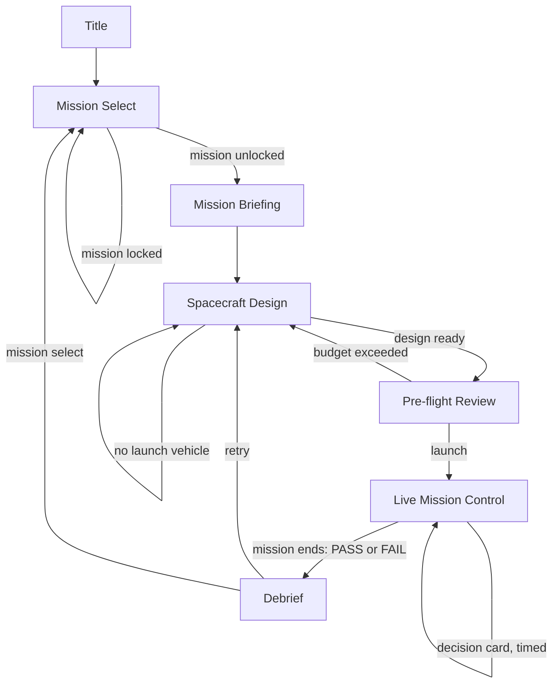

# App Flow — Mission Architect

## 1. Entry Points
- **First visit:** Title screen, starfield background, "Play" and "How to play" (tutorial info).
- **Returning user:** Same title screen — no login, no state carries over between sessions except an optional localStorage personal-best.
- **Shared/deep link:** Not supported in version one (no routing to a specific mission via URL is required, though it's a cheap nice-to-have if React Router is used).

## 2. Authentication Flow
None. No sign up, sign in, verification, password recovery, or sign out — the app has no accounts.

## 3. Screen Inventory

| Screen | Route | Purpose |
|---|---|---|
| Title | `/` | Entry point, branding, Play |
| Mission Select | `/missions` | Choose a mission |
| Mission Briefing | `/missions/:missionId/briefing` | Understand objective/constraints before designing |
| Spacecraft Design | `/missions/:missionId/design` | Build the spacecraft |
| Pre-flight Review | `/missions/:missionId/preflight` | Final checklist before launch |
| Live Mission Control | `/missions/:missionId/control` | Real-time operations phase |
| Debrief | `/missions/:missionId/debrief` | Result, score, real-mission comparison |

### Screen detail

**Title**
- Entry conditions: always available.
- Main content: game name/logo, animated starfield, tagline.
- Primary action: "Play" → Mission Select.
- Secondary actions: none required (a "How to play" link is optional).
- Loading state: N/A (no network).
- Empty/error state: N/A.
- Success state: N/A.
- Next destination: Mission Select.

**Mission Select**
- Entry conditions: always available.
- Main content: 4 mission cards (Earth, Moon, Mars, Asteroid) with name, difficulty, short blurb, lock icon where applicable.
- Primary action: tap a card → Mission Briefing for that mission.
- Secondary actions: none.
- Loading/empty/error: N/A (static data).
- Success state: navigates on tap.
- Next destination: Mission Briefing.

**Mission Briefing**
- Entry conditions: a valid `missionId`; if the mission is locked, redirect to Mission Select.
- Main content: objective, budget cap, hard requirements, real-mission reference blurb.
- Primary action: "Begin design" → Spacecraft Design.
- Secondary actions: "Back" → Mission Select.
- Loading/empty/error: N/A.
- Success state: navigates on tap.
- Next destination: Spacecraft Design.

**Spacecraft Design**
- Entry conditions: valid, unlocked `missionId`.
- Main content: header (mission, step, budget), 2×2 live gauges (mass, power, fuel, comms), category tabs, selected-part card with sliders, spacecraft preview (desktop: right panel).
- Primary action: "Pre-flight review" (disabled until a launch vehicle is selected).
- Secondary actions: "Back" (to Briefing — with a confirmation if the player has made changes, since progress isn't saved).
- Loading/empty/error: inline message if no launch vehicle selected yet.
- Success state: navigates on tap once enabled.
- Next destination: Pre-flight Review.

**Pre-flight Review**
- Entry conditions: a complete (or incomplete-but-attempted) design in memory.
- Main content: green/amber/red checklist per constraint category, each linking back to Design.
- Primary action: "Launch" → Live Mission Control (allowed even with amber/red items — a warning, not a block).
- Secondary actions: "Back to design."
- Loading/empty/error: N/A.
- Success state: navigates on tap.
- Next destination: Live Mission Control.

**Live Mission Control**
- Entry conditions: a finalized design.
- Main content: top bar (mission, phase, clock), timeline strip, 2D orbit/trajectory view, live gauges, controls, decision cards, event log.
- Primary action: respond to decision cards as they appear; otherwise the mission clock advances on its own.
- Secondary actions: manual controls (power allocation, instrument toggles, downlink scheduling, burn buttons) usable at any non-decision-card moment.
- Loading/empty/error: N/A — this screen doesn't pause for anything but decision cards, which always resolve (by choice or timeout default).
- Success/fail state: at end of mission, the state machine determines PASS or FAIL and auto-navigates to Debrief.
- Next destination: Debrief.

**Debrief**
- Entry conditions: a completed mission run in memory.
- Main content: PASS/FAIL banner, 5-bar score breakdown, real-mission comparison table, "what went wrong" note if applicable.
- Primary action: "Retry mission" → Spacecraft Design (same mission, fresh state) or "Mission select" → Mission Select.
- Secondary actions: optional "Save personal best" (nickname text field, writes to localStorage only).
- Loading/empty/error: N/A.
- Success state: navigates on tap.
- Next destination: Spacecraft Design or Mission Select.

## 4. Primary User Journey
Title → Mission Select → pick Earth-orbit (tutorial, unlocked by default) → Mission Briefing → Spacecraft Design (tutorial overlay guides part selection) → Pre-flight Review (all green, thanks to relaxed tutorial limits) → Live Mission Control (relaxed timers, guided through one of each event type) → Debrief (PASS, score shown, comparison to Landsat 9) → Mission Select (Moon/Mars/Asteroid now unlocked).

## 5. Secondary Journeys
- **Fail and retry:** Design → Pre-flight (amber warnings ignored) → Mission Control → FAIL (ran out of fuel) → Debrief ("what went wrong": redo with more fuel margin) → Retry mission → Design (fresh).
- **Skip the tutorial:** Title → Mission Select → Earth-orbit → tutorial overlay dismissed immediately → same flow, no guidance, normal timers.
- **Judge speed-run:** Title → Mission Select → any unlocked mission → Design (accepts all defaults) → Pre-flight → Control → Debrief, in well under 5 minutes.

## 6. Decision Points
| User action | Condition | Result | Destination |
|---|---|---|---|
| Tap locked mission card | Mission not yet unlocked | No navigation, lock indicator shown | stays on Mission Select |
| Tap "Pre-flight review" | No launch vehicle selected | Button disabled | stays on Design |
| Tap "Launch" | Budget exceeded | Blocked — hard limit, must reduce cost first | stays on Pre-flight |
| Tap "Launch" | Any other constraint amber/red | Allowed, proceeds with a warning already shown | Live Mission Control |
| Decision card timer reaches 0 | No response chosen | Defined default (worse-case) response applied | stays on Mission Control |
| Mission clock reaches "end of mission" phase | Fuel/power ≥ 0 at all checkpoints, min. science data collected | PASS | Debrief |
| Mission clock reaches a failure condition | Fuel/power hits 0, or permanent loss of contact, or budget exceeded mid-mission (shouldn't happen — blocked earlier) | FAIL | Debrief |

## 7. Edge Cases and Recovery
- **Invalid input (slider out of range):** clamped client-side; cannot occur through the UI, but defensive clamping stays in the state logic regardless.
- **Failed request:** N/A — no network calls during play.
- **Lost connection:** N/A — fully offline-capable once loaded.
- **Missing permissions:** N/A.
- **Expired session:** N/A — no sessions.
- **Cancelled action (browser tab closed mid-run):** run is lost; on reopening, the app starts fresh at Title. This is accepted (save/resume is out of scope).

## 8. Navigation Rules
- **Global navigation:** No persistent nav bar; each screen's primary/secondary actions are the only way to move (keeps focus, matches a game rather than a dashboard).
- **Back behavior:** Browser back button should be avoided as the primary means of navigation (React Router history can be managed, or the browser back button can be soft-disabled during Live Mission Control specifically, to avoid leaving a run in a broken state — decide during implementation and document the choice).
- **Protected routes:** A mission route for a locked mission always redirects to Mission Select — this is the only route protection needed, and it is a data check, not an auth check.
- **Deep links:** Not required for v1; if implemented, only Title, Mission Select, and Mission Briefing are safe to deep-link to (Design/Pre-flight/Control/Debrief all depend on in-memory state that a fresh page load wouldn't have).

## 9. Flow Diagram

